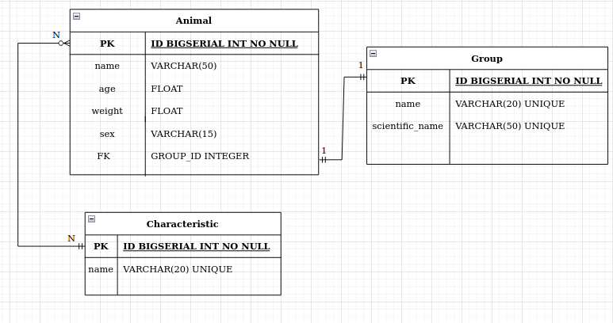

  

API com criação de rotas em Django com Django Rest Framework e validação de entradas.  

Checklist: 

Para essa entrega você terá que desenvolver o seguinte: 

Configuração básica do projeto, incluindo .gitignore, venv, requirements.txt 
OK 

Diagrama de Entidade e Relacionamento. 
OK 

App de animals
    Model - OK  
    Serializers para dados de entrada e saída. Sobreescrita dos métodos create e update do serializer. - OK 
    Views de criação, listagem, filtragem, atualização e deleção de animal.                            - OK 
    Tratamento de exceção nas rotas de criação, atualização, filtragem e deleção.                      - OK 

App de groups 
    Model                                      - OK 
    Serializers para dados de entrada e saída. - OK 

App de characteristics 
    Model                                      - OK 
    Serializers para dados de entrada e saída. - OK 
